<p align="center">
  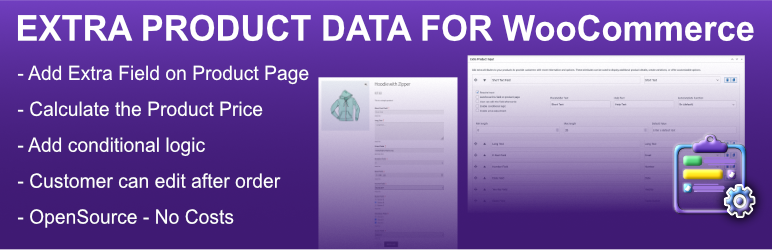
</p>

# Woocommerce Extra Product Data


- [Woocommerce Extra Product Data](#woocommerce-extra-product-data)
  - [General Infos](#general-infos)
  - [Description](#description)
  - [Features](#features)
  - [Installation](#installation)
  - [Development](#development)
  - [Support](#support)
  - [Contributing](#contributing)
    - [Development Setup](#development-setup)
    - [Testing](#testing)
- [Frequently Asked Questions](#frequently-asked-questions)
- [Can the fields be customized?](#can-the-fields-be-customized)
- [Is the plugin compatible with the latest WordPress version?](#is-the-plugin-compatible-with-the-latest-wordpress-version)

## General Infos

Project:             | Woocommerce Extra Product Data
-------------------|----------------
| Contributors | triopsi |
| Tags |  WooCommerce Product Addons, WooCommerce product options, WooCommerce custom fields, WooCommerce product fields  |
| Requires at least |  5.0 |
| Tested up to |  6.x |
| Requires PHP |  > 8.2 |
| Stable tag | 2.0.0 |
| License |  GPLv2 or later |
| License URI |  https://www.gnu.org/licenses/gpl-2.0.html |
| Wordpress Plugin Site | https://wordpress.org/plugins/extra-product-data-for-woocommerce/ |

A WooCommerce plugin that collects additional user data for products and displays it in the order summary.

## Description 

Woocommerce Extra Product Data is a WooCommerce plugin developed to gather additional user information for products. Once installed, this plugin adds custom input fields to WooCommerce product pages, allowing users to enter extra information during the checkout process. These additional data fields are then displayed in the cart, the order summary, and within the backend for easy access.

The plugin was developed by @triopsi using the latest stable PHP version (8.2) and has been tested with the latest WordPress release. Woocommerce Extra Product Data is free and can be easily extended to fit specific needs with just a few clicks.

## Features 

* Adds custom input fields on WooCommerce product pages.
* Supports various input types (text, textarea, select, etc.).
* Works with both Simple Products and Variable Products.
* Captures and stores additional user data for each product.
* Displays the data in the cart, checkout, and order summary.
* Allows admins to view the additional data provided by customers.
* Ideal for products that require user-specific information.
* Easy to extend and customize for specific requirements.
* Added option to make fields conditional based on other field values.
* The admin can still edit the fields in the order overview.

## Installation 

1. Upload the plugin files to the `/wp-content/plugins/extra-product-data-for-woocommerce` directory, or install the plugin directly through the WordPress plugins screen.
2. Activate the plugin through the 'Plugins' screen in WordPress.
3. Go to any WooCommerce product page to see the additional input fields.

## Development

This plugin uses Composer autoloading for its PHP classes.

```bash
composer install
```

## Support

This repository is used for development and issue tracking.

If you need help using the plugin, please use the WordPress.org support forum:

https://wordpress.org/support/plugin/extra-product-data-for-woocommerce/

Bug reports and feature requests are welcome here on GitHub.

## Contributing

We welcome contributions from the community! To contribute to this project:

1. Fork the repository
2. Create a feature branch (`git checkout -b feature/amazing-feature`)
3. Commit your changes (`git commit -m 'Add amazing feature'`)
4. Push to the branch (`git push origin feature/amazing-feature`)
5. Open a Pull Request

### Development Setup

```bash
# Install dependencies
composer install
npm install

# Run tests
npm run test

# Build assets
npm run build
```

### Testing

For End-to-End testing with Playwright, please refer to the [E2E Testing Quick Start Guide](tests/E2E/QUICKSTART.md).

# Frequently Asked Questions 

# Can the fields be customized? 
Yes, the plugin is designed to be extended, allowing developers to modify the fields as needed.

# Is the plugin compatible with the latest WordPress version? 
Yes, the plugin has been tested with the latest WordPress release and PHP > 8.2 .

<p align="center">
  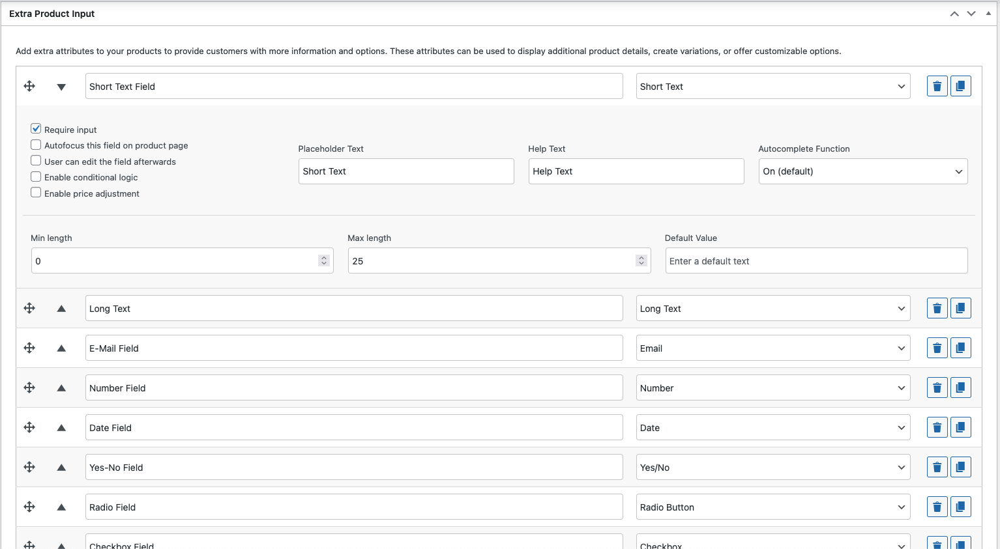
  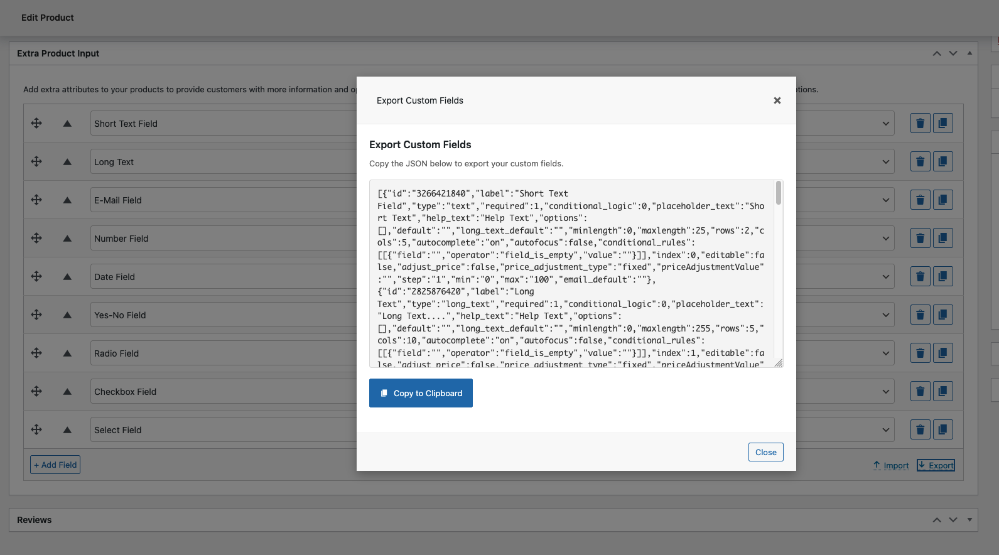
  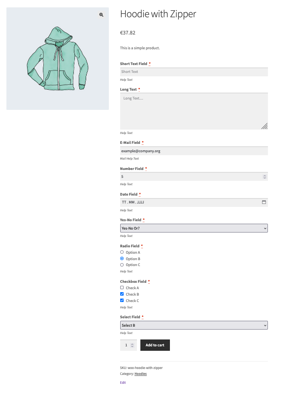
  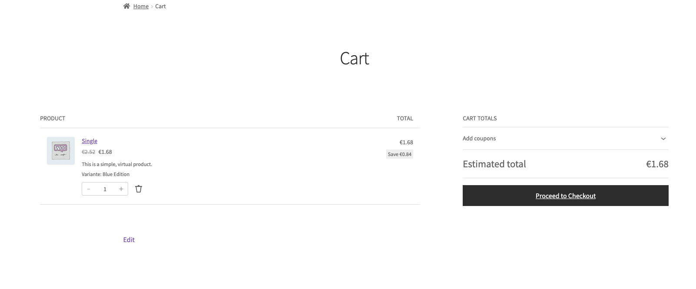
  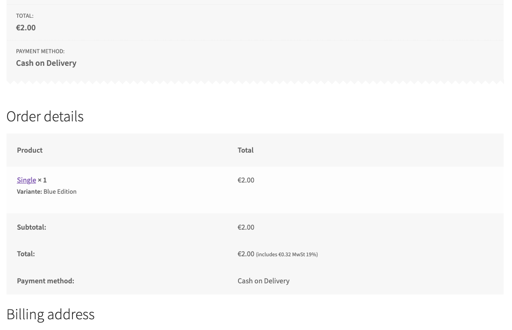
  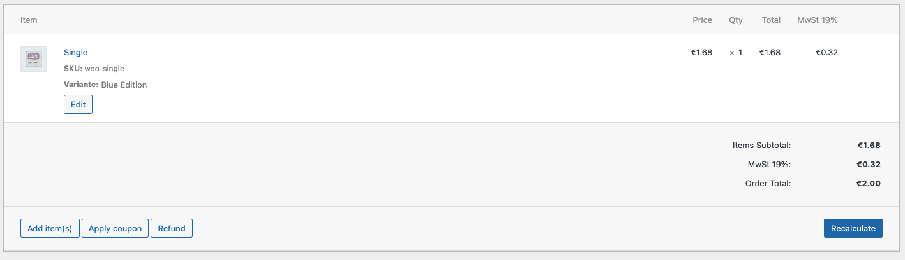
  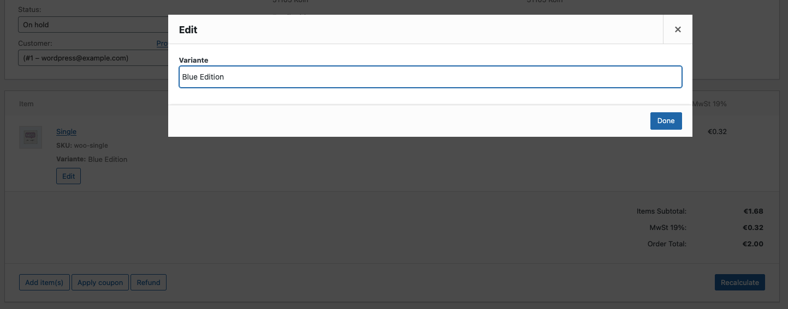
  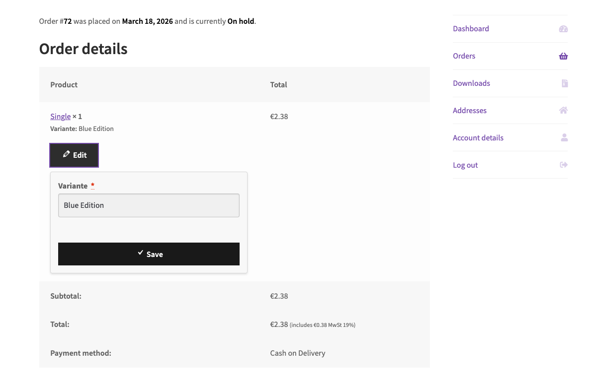
  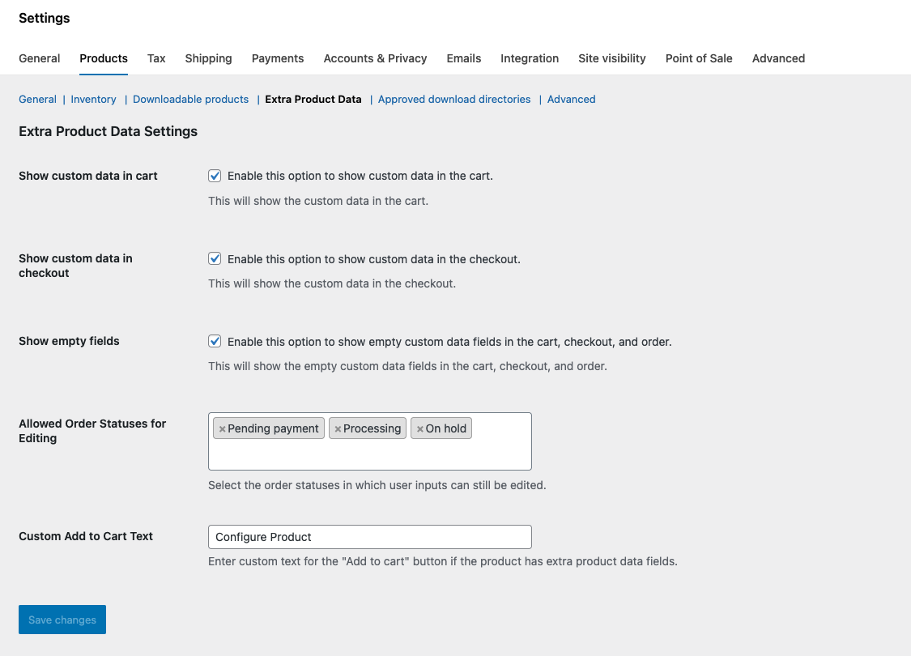
  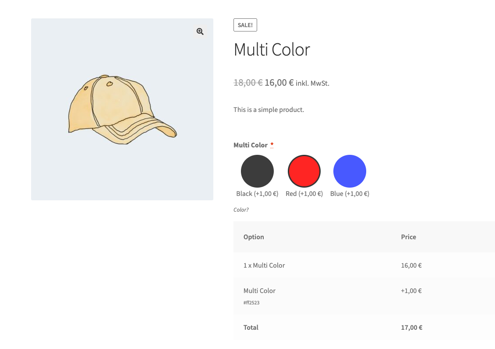
  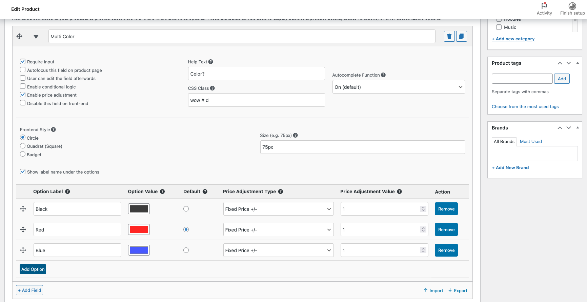
  
  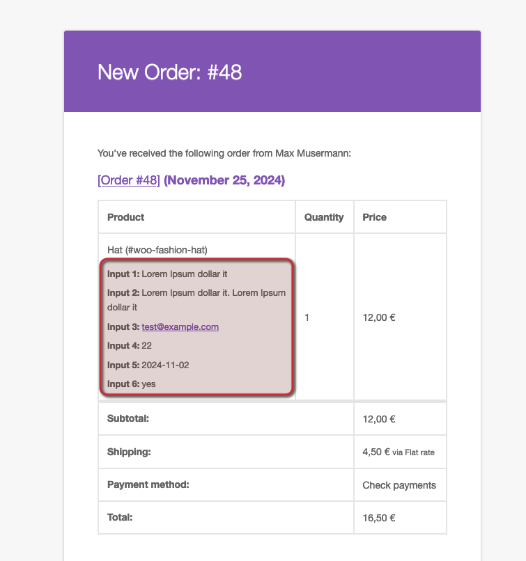
  
</p>