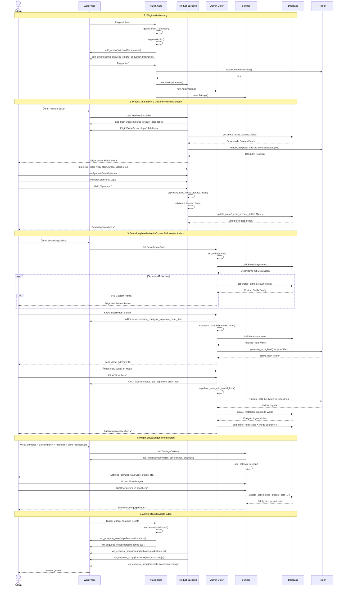

```mermaid
sequenceDiagram
    actor Admin
    participant WP as WordPress
    participant Plugin as Plugin Core
    participant ProductBackend as Product Backend
    participant AdminOrder as Admin Order
    participant Settings as Settings
    participant DB as Database
    participant Helper as Helper
    
    Note over Admin,DB: 1. Plugin-Initialisierung
    WP->>Plugin: Plugin aktiviert
    Plugin->>Plugin: getInstance() (Singleton)
    Plugin->>Plugin: registerHooks()
    Plugin->>WP: add_action('init', loadComponents)
    Plugin->>WP: add_action('admin_enqueue_scripts', enqueueAdminAssets)
    WP->>Plugin: Trigger 'init'
    Plugin->>Helper: isWooCommerceActive()
    Helper-->>Plugin: true
    Plugin->>ProductBackend: new ProductBackend()
    Plugin->>AdminOrder: new AdminOrder()
    Plugin->>Settings: new Settings()
    
    Note over Admin,DB: 2. Produkt bearbeiten & Custom Fields hinzufügen
    Admin->>WP: Öffnet Produkt-Editor
    WP->>ProductBackend: Lädt Produkt-Edit-Seite
    ProductBackend->>WP: add_filter('woocommerce_product_data_tabs')
    ProductBackend->>WP: Fügt "Extra Product Input" Tab hinzu
    ProductBackend->>DB: get_meta('_extra_product_fields')
    DB-->>ProductBackend: Bestehende Custom Fields
    ProductBackend->>Helper: render_template('html-tab-extra-attributes.php')
    Helper-->>ProductBackend: HTML mit Formular
    ProductBackend-->>Admin: Zeigt Custom Fields Editor
    
    Admin->>ProductBackend: Fügt neue Fields hinzu (Text, Email, Select, etc.)
    Admin->>ProductBackend: Konfiguriert Field-Optionen
    Admin->>ProductBackend: Aktiviert Conditional Logic
    Admin->>ProductBackend: Klickt "Speichern"
    
    ProductBackend->>ProductBackend: exprdawc_save_extra_product_fields()
    ProductBackend->>ProductBackend: Validiert & Sanitiert Daten
    ProductBackend->>DB: update_meta('_extra_product_fields', $fields)
    DB-->>ProductBackend: Erfolgreich gespeichert
    ProductBackend-->>Admin: Produkt gespeichert ✓
    
    Note over Admin,DB: 3. Bestellung bearbeiten & Custom Field-Werte ändern
    Admin->>WP: Öffnet Bestellungs-Editor
    WP->>AdminOrder: Lädt Bestellungs-Seite
    AdminOrder->>AdminOrder: set_order($order)
    AdminOrder->>DB: Lädt Bestellungs-Items
    DB-->>AdminOrder: Order Items mit Meta-Daten
    
    loop Für jedes Order Item
        AdminOrder->>DB: get_meta('_extra_product_fields')
        DB-->>AdminOrder: Custom Fields Config
        alt Hat Custom Fields
            AdminOrder-->>Admin: Zeigt "Bearbeiten" Button
        end
    end
    
    Admin->>AdminOrder: Klickt "Bearbeiten" Button
    AdminOrder->>WP: AJAX: woocommerce_configure_exprdawc_order_item
    AdminOrder->>AdminOrder: exprdawc_load_edit_modal_form()
    AdminOrder->>DB: Lädt Item-Metadaten
    DB-->>AdminOrder: Aktuelle Field-Werte
    AdminOrder->>Helper: generate_input_field() für jedes Field
    Helper-->>AdminOrder: HTML Input-Felder
    AdminOrder-->>Admin: Zeigt Modal mit Formular
    
    Admin->>AdminOrder: Ändert Field-Werte im Modal
    Admin->>AdminOrder: Klickt "Speichern"
    AdminOrder->>WP: AJAX: woocommerce_edit_exprdawc_order_item
    AdminOrder->>AdminOrder: exprdawc_save_edit_modal_form()
    AdminOrder->>Helper: validate_field_by_type() für jedes Field
    Helper-->>AdminOrder: Validierung OK
    AdminOrder->>DB: update_meta() für geänderte Werte
    DB-->>AdminOrder: Erfolgreich gespeichert
    AdminOrder->>DB: add_order_note("Field X wurde geändert")
    AdminOrder-->>Admin: Änderungen gespeichert ✓
    
    Note over Admin,DB: 4. Plugin-Einstellungen konfigurieren
    Admin->>WP: WooCommerce > Einstellungen > Produkte > Extra Product Data
    WP->>Settings: Lädt Settings-Sektion
    Settings->>WP: add_filter('woocommerce_get_settings_products')
    Settings->>Settings: add_settings_section()
    Settings-->>Admin: Settings-Formular (Max Order Status, etc.)
    
    Admin->>Settings: Ändert Einstellungen
    Admin->>Settings: Klickt "Änderungen speichern"
    Settings->>DB: update_option('extra_product_data_...')
    DB-->>Settings: Erfolgreich gespeichert
    Settings-->>Admin: Einstellungen gespeichert ✓
    
    Note over Admin,DB: 5. Admin CSS/JS Assets laden
    WP->>Plugin: Trigger 'admin_enqueue_scripts'
    Plugin->>Plugin: enqueueAdminAssets()
    Plugin->>WP: wp_enqueue_style('exprdawc-backend-css')
    Plugin->>WP: wp_enqueue_style('exprdawc-forms-css')
    ProductBackend->>WP: wp_enqueue_script('wc-meta-boxes-product.min.js')
    ProductBackend->>WP: wp_enqueue_script('import-export-modal.min.js')
    AdminOrder->>WP: wp_enqueue_script('wc-meta-boxes-order.min.js')
    WP-->>Admin: Assets geladen
```